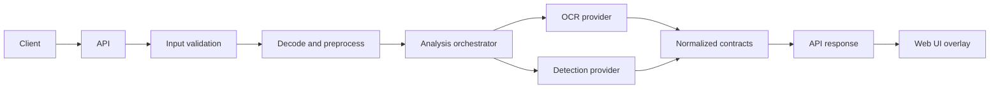

# Architecture

## Decision
**[Decision]** Modular monolith: one deployable Python application with strict internal module boundaries. See [ADR-0001](ADR/ADR-0001-modular-monolith.md).

## Layers and responsibilities
| Layer | Responsibility | May depend on |
|---|---|---|
| `apps/web` | Browser UI, overlay rendering | API contract only |
| `apps/api` | HTTP, request/response mapping, error mapping | `core/*` |
| `core/pipeline` | Orchestrates analysis, timing, partial failure | `core/contracts`, providers |
| `core/vision` | Image decoding, preprocessing, detection provider | `core/contracts` |
| `core/ocr` | OCR provider | `core/contracts` |
| `core/spatial` | Coordinate transforms, pose, anchors (future) | `core/contracts` |
| `core/storage` | Temp files, optional persistence | none |
| `core/contracts` | Schemas and shared types | none |

Rule: dependencies point toward `core/contracts`. `core/ocr`, `core/vision`, `core/spatial` do not import each other; the pipeline composes them.

## Provider abstraction
Each capability exposes an interface (e.g. `OcrProvider.run(image) -> OcrResult`) returning normalized contract types. Concrete engines (PaddleOCR, a YOLO-family model, alternatives) are swappable and never leak engine-specific types beyond the provider.

## Error handling
Providers raise typed errors; the pipeline converts them to per-capability status (`ok`, `failed`, `skipped`, `unavailable`) so one failure does not discard other results. The API maps request-level errors to the structured error format.

## Asynchronous processing
Inference is CPU-bound: run in a worker thread/process pool with bounded concurrency so the event loop stays responsive. For live mode, a bounded frame queue drops stale frames. LLM calls run on a separate path and never block vision.

## Diagram

## Future: live and spatial (not implemented)
Camera → bounded frame queue → inference → tracking → scene state → UI. Voice → STT → target association → LLM → text/TTS/panel, in parallel. Spatial requires real pose, tracking, and depth before any world-space output.
