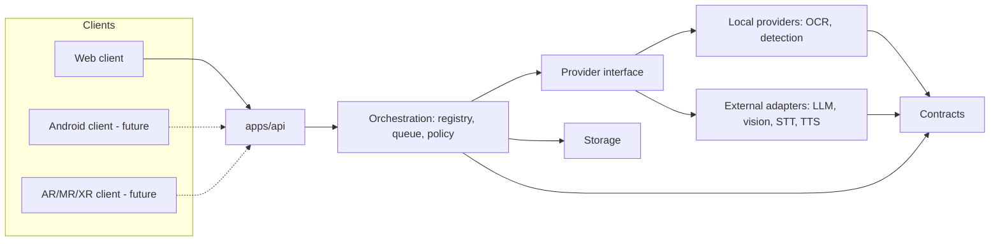
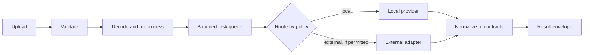
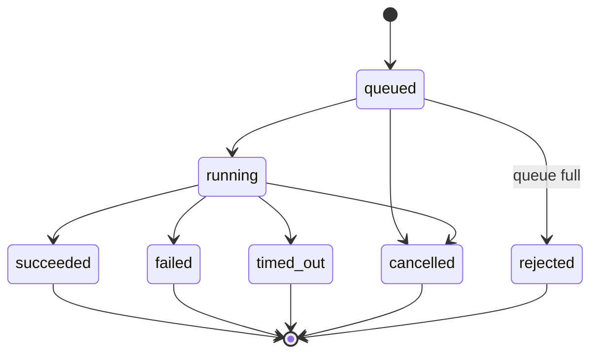

# Architecture

## Decisions
- **[Decision]** Modular monolith: [ADR-0001](ADR/ADR-0001-modular-monolith.md).
- **[Decision]** Hybrid inference via provider adapters: [ADR-0002](ADR/ADR-0002-hybrid-inference.md).
- **[Decision]** Spatial capability boundaries: [ADR-0003](ADR/ADR-0003-spatial-capability-boundaries.md).

## Modules and responsibilities
| Module | Path | Responsibility |
|---|---|---|
| API / app services | `apps/api` | HTTP, auth hooks, request/response mapping |
| Web client | `apps/web` | Upload UI, overlay (future: camera, Android client) |
| Contracts | `core/contracts` | Schemas, enums, shared types |
| Orchestration | `core/orchestration` | Capability registry, task queue, lifecycle, routing policy, timeouts, cancellation |
| Vision | `core/vision` | Decoding, validation helpers, preprocessing, detection/tracking (later) |
| OCR | `core/ocr` | OCR provider implementations |
| Providers | `core/providers` | Provider interface, local/external adapters, mock providers |
| Voice | `core/voice` | STT, intent, TTS (Phase 6) |
| Spatial | `core/spatial` | Transforms, pose, anchors (Phase 8+) |
| Storage | `core/storage` | Temp files, sessions, retention |

## Dependency direction
`apps/*` → `core/orchestration` → `core/providers` → `core/contracts`. Feature modules (`ocr`, `vision`, `voice`, `spatial`) implement provider interfaces and depend only on `core/contracts` (and `core/providers` for the interface). Feature modules never import each other; orchestration composes them. `core/contracts` imports nothing from the project.

## Component diagram

## Data flow (image analysis)

## Inference paths
Local path: provider runs in a worker with timeout; model lazy-loaded. External path: only if the capability policy permits it and data-transmission consent is configured ([API_PROVIDER_POLICY.md](API_PROVIDER_POLICY.md)). If neither is available the result is `unavailable`.

## Task lifecycle

## Error boundaries
Request validation (API) → capability execution (orchestration, per task) → provider (adapter, typed errors). Each boundary converts errors into the envelope; one capability failing never discards others. Details: [ERROR_HANDLING.md](ERROR_HANDLING.md).

## Concurrency and resource control
Bounded queue, configurable worker count (default conservative, **provisional**), per-task timeout, cooperative cancellation, at most one heavy model resident by default, lazy loading and idle unloading. Camera capture never awaits external AI. See [RESOURCE_BUDGET.md](RESOURCE_BUDGET.md).

## Windows deployment considerations
Run natively with a Python venv; no Docker/WSL/GPU required. Bind to `127.0.0.1` by default. Watch path length and native-wheel availability. See [WINDOWS_SETUP.md](WINDOWS_SETUP.md).

## Extension points
New clients use the same HTTP contract (Android, XR). New providers implement the provider interface and register in the capability registry. Spatial results enter only through `core/spatial` with validated pose/depth ([SPATIAL_COMPUTING_PLAN.md](SPATIAL_COMPUTING_PLAN.md)).
