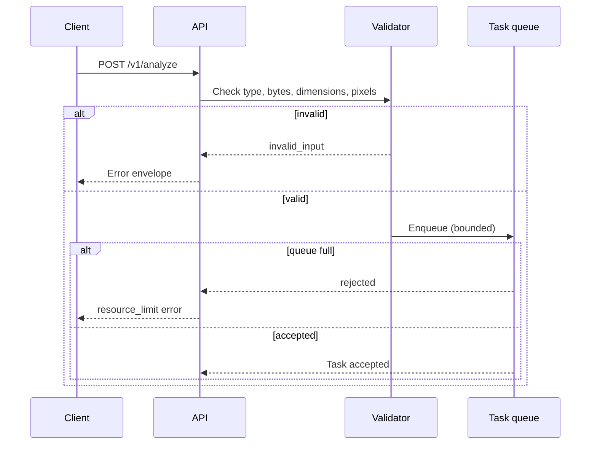
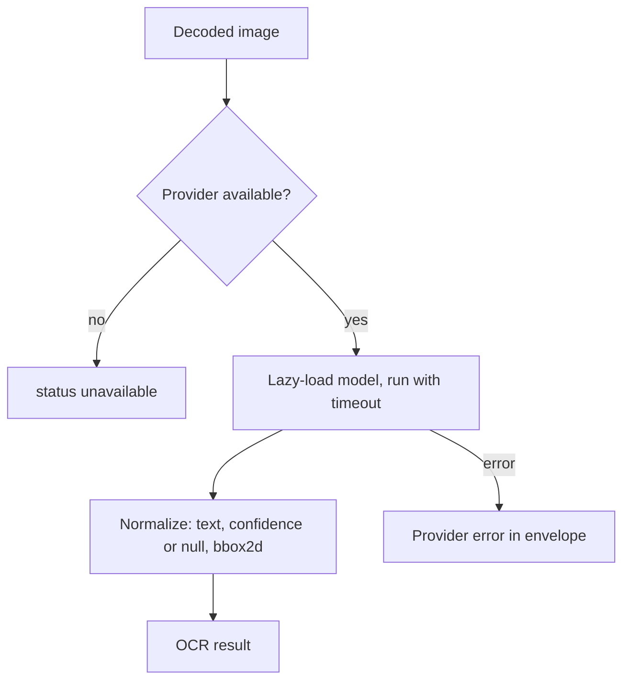
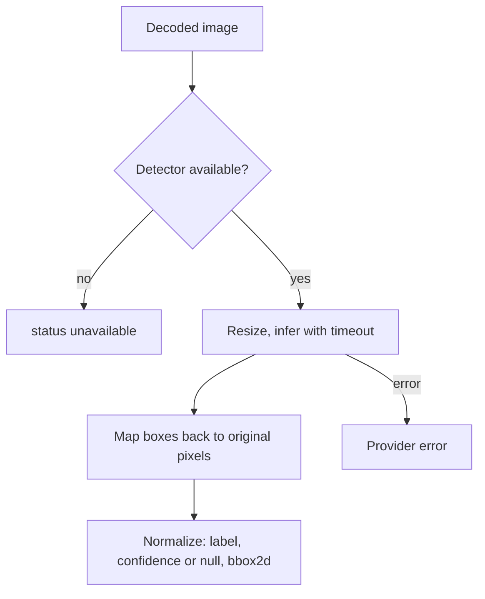
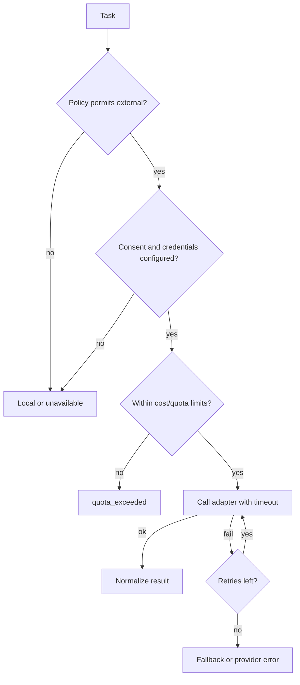
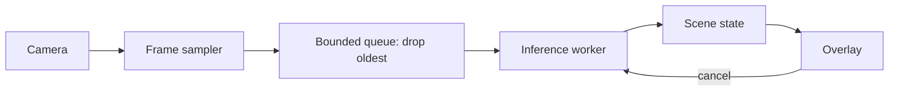
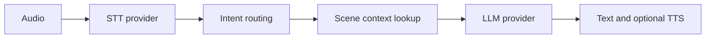
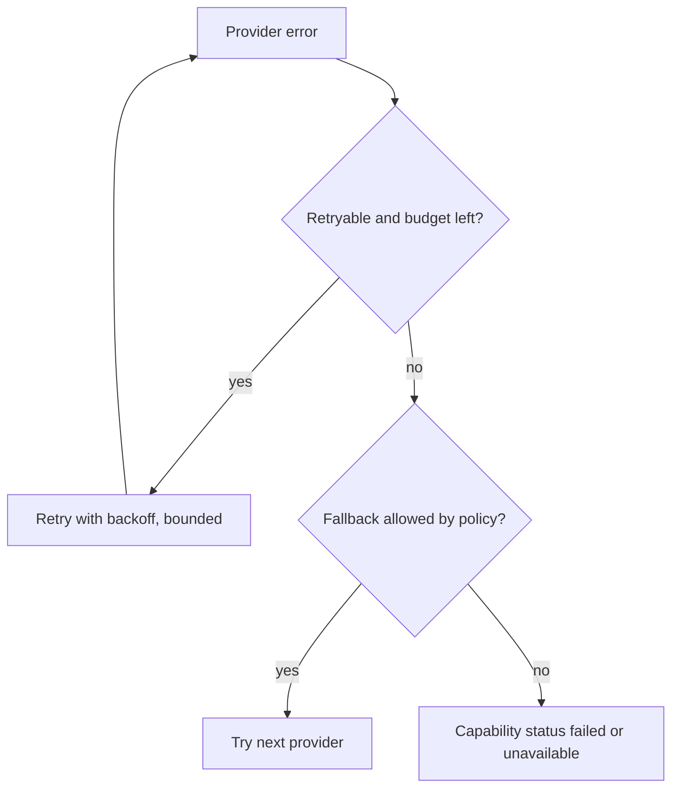
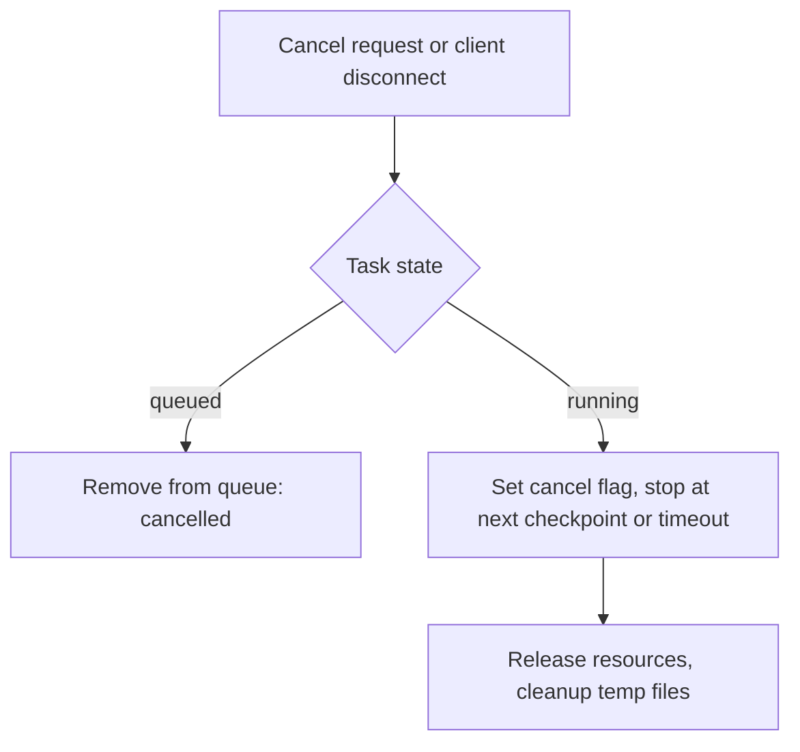
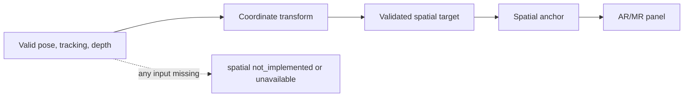

# Process Flows

All flows are **planned** unless the roadmap evidence says otherwise.

## 1. Image ingestion

## 2. OCR

## 3. Object detection (Phase 3)

## 4. External AI request (Phase 4)

## 5. Live camera (Phase 5)

Capture and sampling never wait for external AI.

## 6. Voice request (Phase 6)

Runs on a separate path from the vision loop.

## 7. Provider failure

## 8. Cancellation

## 9. Future spatial processing (Phase 8+)

