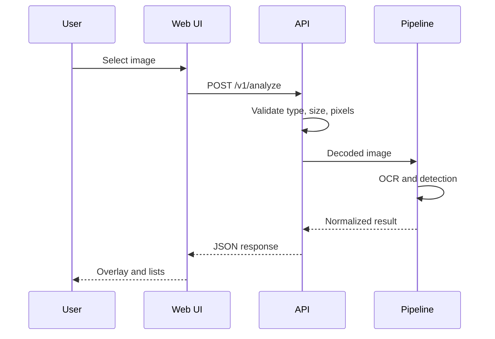
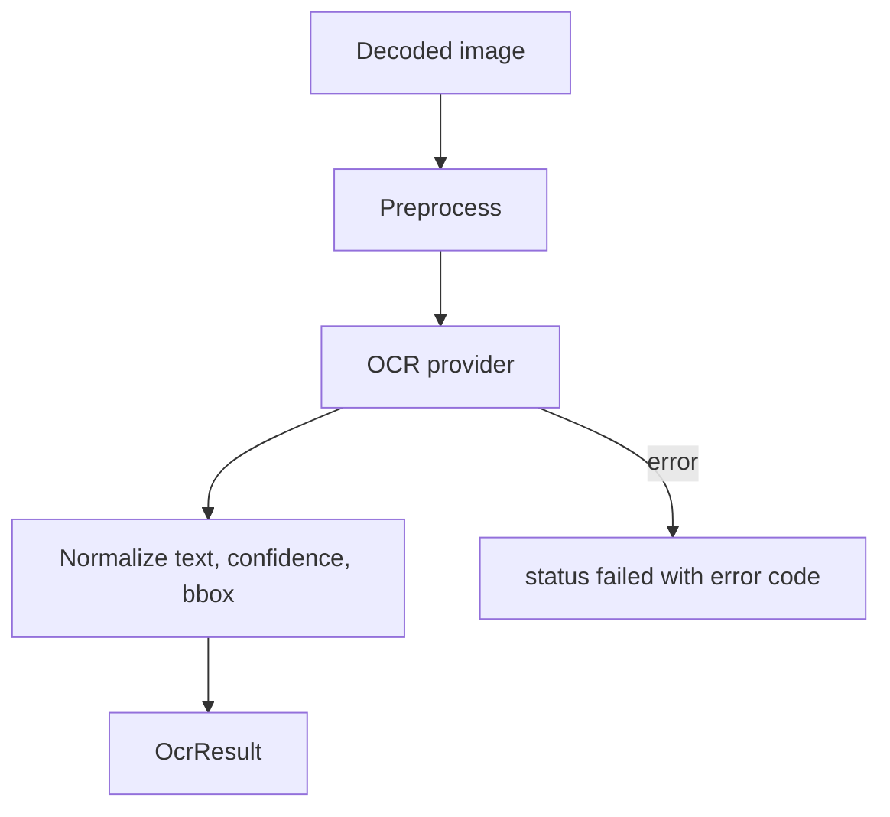
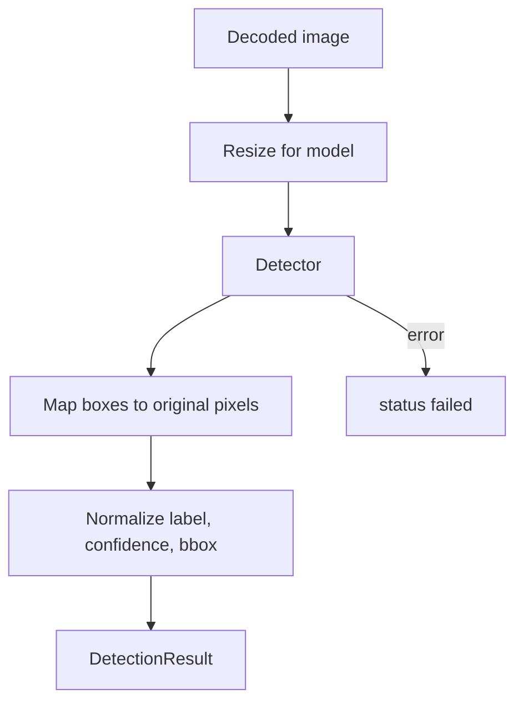
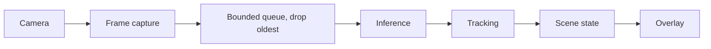
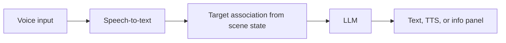
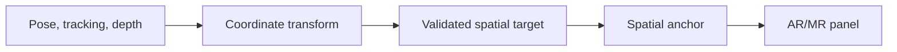
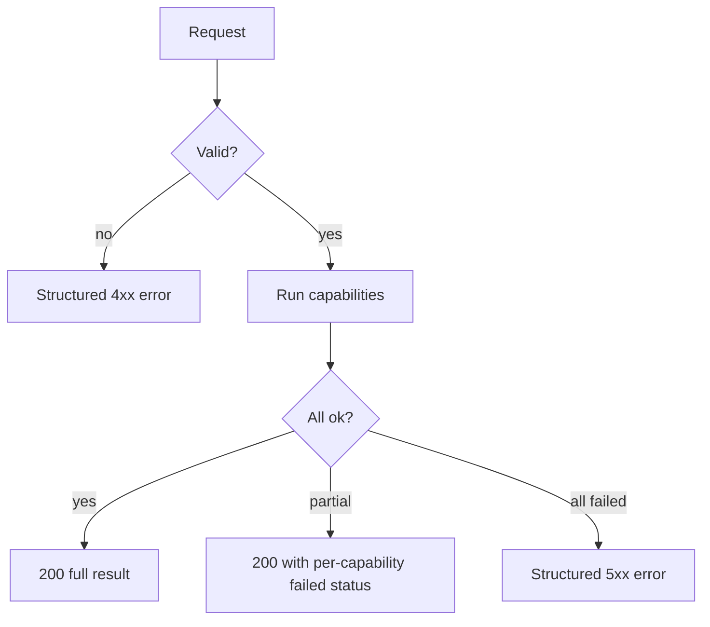

# Process Flows

All flows below are **planned** unless the roadmap says otherwise.

## 1. Image upload and analysis

## 2. OCR

Confidence is `null` if the provider gives none. Text is untrusted content (see prompt-injection notes in security doc).

## 3. Object detection

## 4. Real-time camera (Phase 6)

## 5. Voice to AI to speech (Phase 7)

Runs in parallel with flow 4; vision never waits for the LLM.

## 6. Spatial tracking and AR/MR (Phases 8–9)

If any input is missing the result is `spatial.status = "unavailable"`; 2D boxes are never promoted to 3D.

## 7. Error handling and fallback

